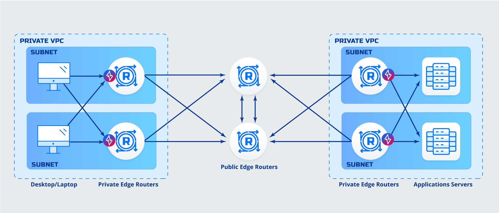

import Share15Md from './share/_share15.mdx';
import Share43Md from './share/_share43.mdx';
import Share12Md from './share/_share12.mdx';
import Share31Md from './share/_share31.mdx';

# ZTNA

This article describes the various edge deployments of ZiTi Network Access. In all cases, the Controller and at least 2 Public Edge Routers are to be deployed for redundency. The Ziti Fabric connections are established between all Edge Routers but not Clients/SDKs. The Public Edge Routers would provide connection between Private Edge Routers and/or Clients/SDKs.

&nbsp;

:::info Note

- *Recommended configuration deployment of Public Edge Routers is to have only Ziti Edge enabled and of Private Edge Routers is to have Ziti Edge enabled with Tunnel option being required for cases where the Zero Trust domain ends at the private edge router.*

- *Acronyms used in this article:*
    - *ZDE - Ziti Desktop Edge*
    - *ZME - Ziti Mobile Edge*
    - *ZET - Ziti Edge Tunnel*
    
:::

&nbsp;

    ---    
1. **Application to Router A Deployment**
    &nbsp;

    <Share15Md />

    &nbsp;

    --- 
1. **Application to Router B Deployment**
    &nbsp;

    <Share43Md />

    &nbsp;
  
1. **Client to Router Deployment**
    &nbsp;

    <Share12Md />
    
    ---
1. **Router to Host Deployment**
    &nbsp;
    
    <Share31Md />

    &nbsp;
    
    ---
1. **Router to Router Deployment**
    &nbsp;
    
    

    :::info Details
    - Clients are behind Router
    - Application is behind Router
    :::

    &nbsp;
    
    :::tip Advantages
    - No software must be deployed to clients
    - No software must be deployed to application servers
    :::

    &nbsp;
            
    :::caution Things to consider while deciding
    - Less secure, connection from clients to router is not protected
    - Less secure, connection from private router to application is not protected
    - Static/Dynamic Routing or Load Balancer is needed to direct traffic toward Routers
    - Clients must be configured use Routers as first DNS entry if using named services
    :::

