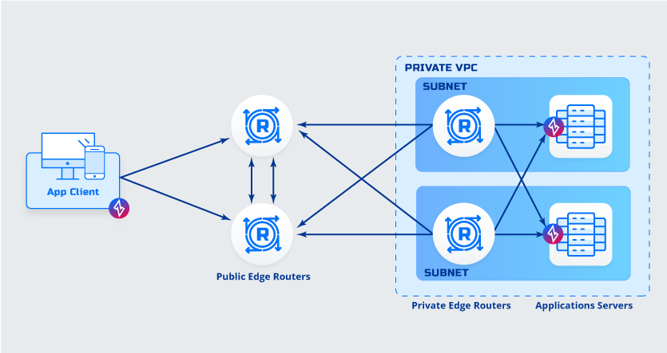
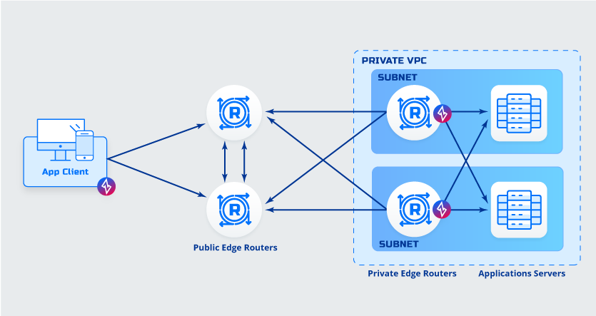
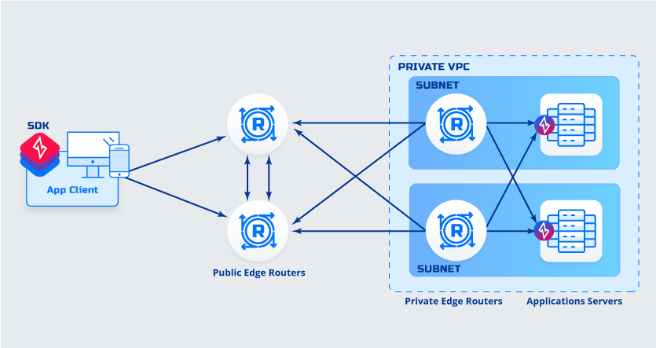
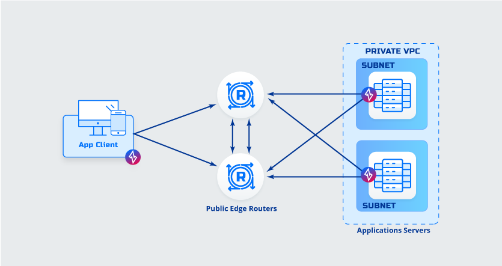
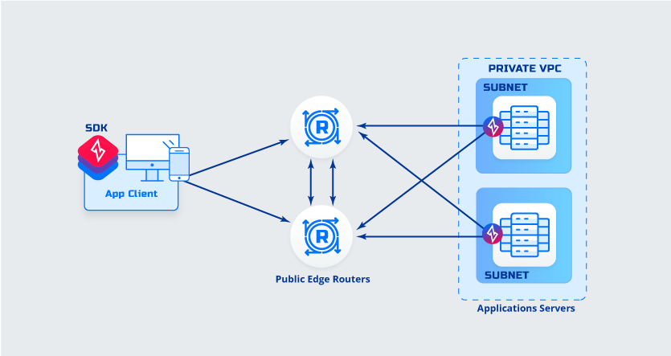

# ZTHA

This article describes the various edge deployments of ZiTi Host Access. In all cases, the Controller and at least 2 Public Edge Routers are to be deployed for redundency. The Ziti Fabric connections are established between all Edge Routers but not Clients/SDKs. The Public Edge Routers would provide connection between Private Edge Routers and/or Clients/SDKs.

&nbsp;

:::info Note

- *Recommended configuration deployment of Public Edge Routers is to have only Ziti Edge enabled and of Private Edge Routers is to have Ziti Edge enabled with Tunnel option being required for cases where the Zero Trust domain ends at the private edge router.*

- *Acronyms used in this article:*
    - *ZDE - Ziti Desktop Edge*
    - *ZME - Ziti Mobile Edge*
    - *ZET - Ziti Edge Tunnel*
    
:::

&nbsp;

1. **Client to Host Deployment**
    &nbsp;

    

    :::info Details
    - Client is ZDE/ZME enabled
    - Application host has a client software (ZET) deployed
    :::

    &nbsp;

    :::tip Advantages
    - Client to Host Encryption 
    - No additional routing needed
    - No additional DNS entries needed
    :::

    &nbsp;

    :::caution Things to consider while deciding
    - Software must be deployed to desktops/mobile
    - Software must be deployed to application servers
    - Requires defining explicit service for each application
    :::

    &nbsp;

    ---    
1. **Client to Router Deployment**
    &nbsp;
    
    

    :::info Details
    - Client is ZDE/ZME enabled
    - Router is tunnel enabled
    :::

    &nbsp;
    
    :::tip Advantages
    - No software must be deployed to application servers
    - No additional routing needed
    - No additional DNS entries needed
    :::
        
    &nbsp;

    :::caution Things to consider while deciding
    - Software must be deployed to desktops/mobile
    - Less secure, connection from private router to application is not protected
    :::

    &nbsp;

1. **Router to Host Deployment**
    &nbsp;
    
    

    :::info Details
    - Clients are behind Router
    - Application host has a client software (ZET) deployed
    :::

    &nbsp;
    
    :::tip Advantages
    - No software must be deployed to clients
    :::

    &nbsp;
        
    :::caution Things to consider while deciding
    - Less secure, connection from clients to router is not protected
    - Static Routing or Load Balancer is needed to direct traffic toward Routers
    - Clients must be configured use Routers as first DNS entry if using named services
    :::

    &nbsp;

    ---
1. **Application to Host Deployment**
    &nbsp;

    

    :::info Details
    - Client is SDK integrated.
    - Application has a client software (ZET) deployed
    :::

    &nbsp;

    :::tip Advantages
    - Application to Host Encryption 
    - No additional routing needed
    - No additional DNS entries needed
    :::

    &nbsp;

    :::caution Things to consider while deciding
    - Software must be deployed to application servers
    - Requires defining explicit service for each application
    :::

    &nbsp;

    ---    
1. **Client to Host Deployment**
    &nbsp;

    

    :::info Details
    - Client is ZDE/ZME enabled
    :::
    
    :::tip Advantages
    - No need to deploy private edge routers
    - Application to Host Encryption
    :::

    &nbsp;
        
    :::caution Things to consider while deciding
    - Fabric is not extended into application server network
    - Application host has a client software (ZET) deployed
    :::

    &nbsp;

    ---
1. **Application to Host Deployment**
    &nbsp;
    
    
    
    :::info Details
    - Client is SDK integrated
    :::

    &nbsp; 

    :::tip Advantages
    - No need to deploy private edge routers
    - Application to Host Encryption
    :::

    &nbsp;
        
    :::caution Things to consider while deciding
    - Fabric is not extended into application server network
    - Application host has a client software (ZET) deployed
    :::

   